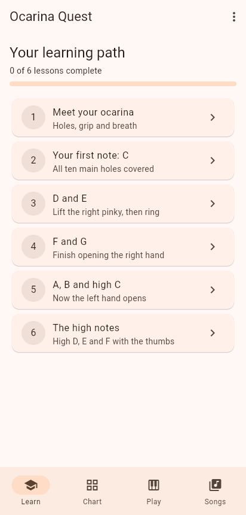
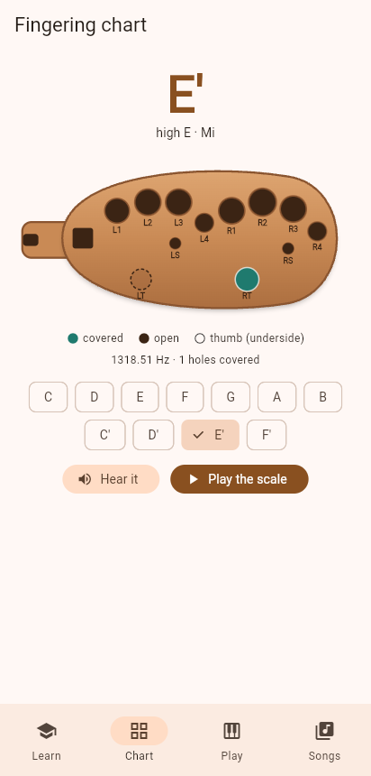
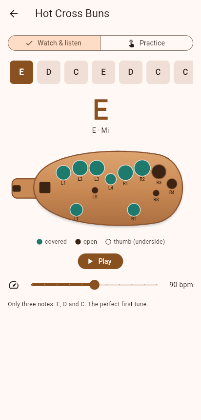

# Ocarina Quest

An interactive Flutter app that teaches you to play the **12-hole alto C
ocarina**, from holding it for the first time to playing full songs.

| Learn | Fingering chart | Song player |
|---|---|---|
|  |  |  |

## Why Flutter

* One codebase for Android, iOS and the web (desktop can be enabled later).
* `CustomPainter` makes it easy to draw an ocarina and animate fingerings.
* Fast iteration with hot reload while tuning lessons and visuals.

## What's in it

* **Learn**: six lessons in a learning path. Each mixes explanations,
  new-note introductions you can hear, *fingering quizzes* where you tap the
  holes on the ocarina yourself, and *ear-training* quizzes. Progress is saved
  on the device.
* **Chart**: every natural note from C to high F. Tap a note to see and hear
  it, or press **Play the scale** to watch the fingering animate up and down
  like a short video.
* **Play**: a virtual ocarina. Cover and uncover holes and it tells you which
  note you're fingering and plays it.
* **Songs**: six public-domain melodies (Hot Cross Buns to Amazing Grace)
  with two modes:
  * **Watch & listen**: the app plays the melody while the diagram animates
    each fingering, with adjustable tempo.
  * **Practice**: set each fingering on the diagram; the song only advances
    when you get it right.

Sound is synthesized in pure Dart (`lib/audio/tone_synth.dart`), so there are
no audio assets to ship and every pitch is exact.

## Running

```sh
flutter pub get
flutter run            # pick a device, or:
flutter run -d chrome
flutter test
```

## Project layout

```
lib/
  models/     Hole, OcarinaNote, Song (+ melody notation parser), Lesson steps
  data/       Fingering chart, songs, lessons: edit these to add content
  audio/      Tone synthesizer (WAV encoder) and the SoundPlayer interface
  state/      Progress persistence and the AppScope inherited widget
  widgets/    The animated, tappable ocarina diagram
  screens/    Learn, lesson, chart, free play, songs, song player
test/         Chart consistency, notation parser, synth and widget tests
```

### Adding a song

Songs use a compact notation in `lib/data/songs.dart`: note ids
`C D E F G A B C' D' E' F'`, `R` for a rest, `/beats` for length (default 1)
and `|` for bar lines, e.g. `E D C/2 | R/0.5 G/1.5`.

## Roadmap

* **Listen mode**: use the microphone and pitch detection to check that you
  are really playing the right note on your own ocarina.
* Sub-hole notes (low A and B), sharps and flats via half-holing.
* Other ocarina types: 6-hole pendant, 4-hole English.
* Short technique videos (breathing, tonguing, vibrato) alongside the
  animated diagrams.
* Rhythm scoring and daily practice streaks.
